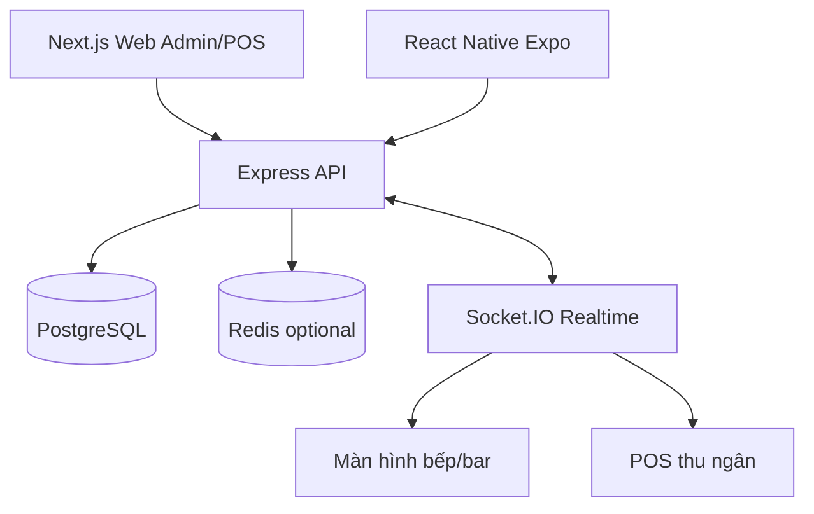

# Kiến trúc POS SaaS Platform

## Multi-tenant

Bản MVP dùng mô hình shared database/shared schema. Các bảng nghiệp vụ có `tenantId` để cô lập dữ liệu từng khách thuê.

## Module chính

- Auth JWT
- Super Admin
- Tenant / Branch
- Area / Table
- Product / Category
- POS Order
- Kitchen Display
- Payment
- Report Dashboard
- Mobile scaffold

## Mở rộng tiếp

- RBAC chi tiết bằng bảng Role/Permission
- Prisma Migration production
- Redis Adapter cho Socket.IO khi scale nhiều instance
- Inventory tự trừ kho theo Recipe
- QR Order cho khách hàng
- CRM/Zalo/SMS/Email
- AI dự đoán doanh thu và nhập hàng
